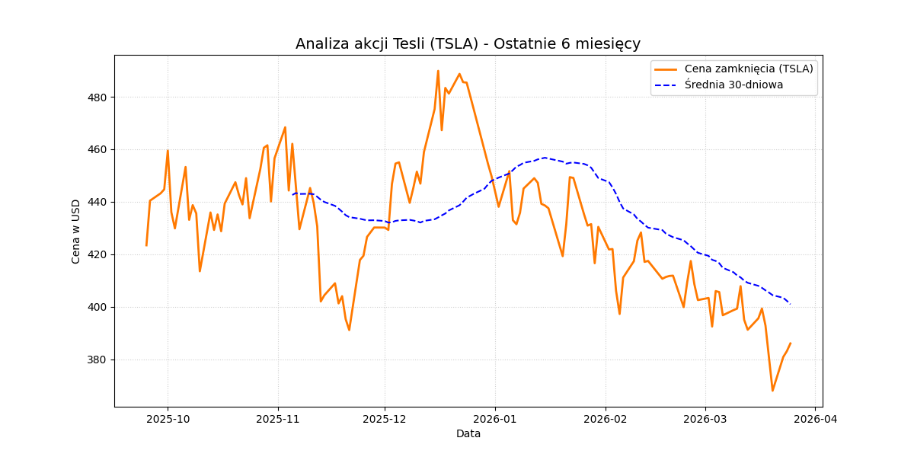

# Tesla Stock Price Analysis 📈🚗

A simple data analysis project focused on fetching, processing, and visualizing financial data for Tesla (TSLA) stock. 

## 🛠️ Technologies Used
* **Python** * **yfinance** - for fetching real-time market data
* **pandas** - for data manipulation and rolling averages calculations
* **matplotlib** - for data visualization

## 📊 Project Overview
The script downloads the last 6 months of historical stock prices for Tesla. It calculates a 30-day moving average to smooth out daily market noise and identify short-term trends. The processed data is exported to a CSV file for further analysis.

## 📉 Visual Results
Below is the visualization of the closing price compared to the 30-day moving average:

